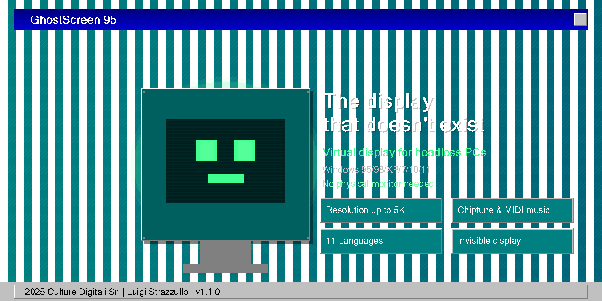
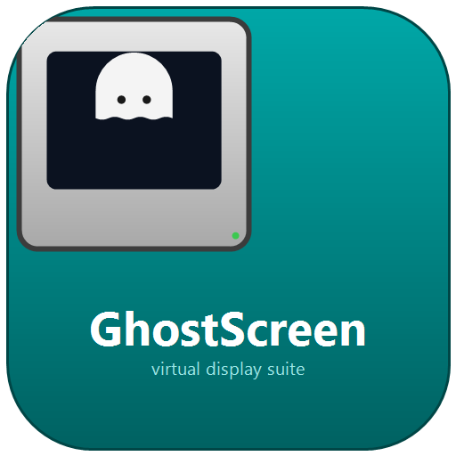

# GhostScreen 95

### The display that doesn't exist.

**Your headless PC just got a monitor. A phantom one. In 4K.**

 

**Single-file EXE · No installers · No internet needed · Windows 10/11 x64**

---

## The problem

Your machine is a **headless box**: a server in a rack, a laptop with a broken screen, a
workstation reached over RDP or Chrome Remote Desktop. There is no physical monitor —
so Windows gives you **no monitor at all**.

And then everything breaks:

- Remote sessions cap at a blurry **800x600** (or 640x480)
- Apps you *know* are fullscreen show a tiny centered window
- Games, design tools and media players refuse to render properly
- UI scaling makes everything look like a spreadsheet from 1993

You can't buy a monitor for a machine you'll never look at. So what do you do?

## The fix

**GhostScreen 95** installs a *virtual display* — a monitor that exists only in software —
and dials in the resolution **you** choose: **2560x1440**, **1920x1080**, **1366x768**,
**1280x720**, right out of the box at 60 Hz.

The OS thinks a beautiful monitor is plugged in. Remote clients happily render
widescreen, full-HD sessions. Your headless rig behaves like a normal desktop —
because, as far as Windows is concerned, it *is* one.

> A ghost screen. It's there. It isn't. Nobody knows. Windows loves it.

## What you get

| | |
|---|---|
| **One EXE, everything inside** | Driver, catalog, settings, tools — all embedded. No installer, no leftovers. |
| **Windows 95 soul** | A faithful '95-era UI. Gradient title bar, chiseled buttons, MS Sans Serif. Because why not. |
| **Choose your resolution** | 2560x1440, 1920x1080, 1366x768, 1280x720 — plus **custom W×H×Hz** (up to 4K). |
| **11 languages** | italiano, español, français, deutsch, english, 中文, 日本語, português, русский, 한국어, nederlands — auto-detected, or from the **Lingua** menu, persisted in the registry. |
| **Game Boy music** | Chiptune synthesized at runtime **or real MIDI** (generated .mid), with volume control (25–100%). Mute it in File ▾. |
| **Themes** | Teal (classic), Plum, Eggplant, Dark Pro — like the Windows Plus! packs of 1996. |
| **System tray ghost** | Minimize to tray; apply / restart from the tray icon. |
| **Auto-start at logon** | Re-applies your resolution on every login (scheduled task + `/apply`). |
| **Diagnostic report** | One click → a ZIP on your Desktop with log, system info and driver state. |
| **Update check** | Optional, offline by default: checks the GitHub release API only when asked. |
| **Uninstaller** | Menu item or `/uninstall` — removes driver, device, registry and task. |
| **Self-healing** | Detects a missing or stale driver, reinstalls, restarts the display, retries. Works on a fresh format. |
| **Zero internet** | Everything runs offline, from the EXE (except the optional update check). |
| **Re-runnable** | You formatted? Run it again. It's idempotent. |

## Quick start

1. Download `GhostScreen-1.1.0.exe` from [releases](releases/).
2. Right-click → **Run as administrator**.
3. Pick your resolution. Hit **Installa e Applica**.
4. Done. Your remote session is now 2560x1440. 🎩

Fine print: requires Windows 10/11 x64 and the built-in .NET Framework 4.x (preinstalled).
The 60-second run applies the resolution; a reboot persists it.

## Multilingual

The program speaks **11 languages**, auto-detected from your OS (or picked from the
**Lingua** menu / saved in the registry). The site is published in 7 of them:

| Language | Site |
|---|---|
| Italiano | [it.html](https://culturedigitali.github.io/GhostScreen/it.html) |
| Español | [es.html](https://culturedigitali.github.io/GhostScreen/es.html) |
| Français | [fr.html](https://culturedigitali.github.io/GhostScreen/fr.html) |
| Deutsch | [de.html](https://culturedigitali.github.io/GhostScreen/de.html) |
| English | [index.html](https://culturedigitali.github.io/GhostScreen/) |
| 中文 | [zh.html](https://culturedigitali.github.io/GhostScreen/zh.html) |
| 日本語 | [ja.html](https://culturedigitali.github.io/GhostScreen/ja.html) |
| Português | in-app only |
| Русский | in-app only |
| 한국어 | in-app only |
| Nederlands | in-app only |

Command line: `GhostScreen.exe /lang:de /nosound /quiet /music:midi /volume:50 /theme:plum`
(`/apply` applies silently and exits — used by auto-start; `/uninstall` removes everything).

## Use cases

- **Headless servers** managed over RDP — real resolution, real productivity
- **Laptops with broken screens** — HDMI out is dead, but the machine isn't
- **HTPCs** attached to a TV that's often off — keep the desktop sane
- **CI/CD and test labs** — stable virtual displays for UI tests
- **Remote work** via Chrome Remote Desktop / AnyDesk / TeamViewer — crisp widescreen
- **GPU farms and mining rigs** — dummy-plug alternative without the dongle

See [docs/CASE-STUDIES.md](docs/CASE-STUDIES.md) for the full stories.

## Documentation

- [Product vision](docs/PRODUCT.md)
- [Case studies](docs/CASE-STUDIES.md)
- [Test environment & matrix](docs/TESTED-ON.md)
- [Handoff / developer guide](HANDOFF.md) — everything a new developer or AI agent needs to take over
- [Build from source](src/build.ps1) — needs only the .NET Framework csc.exe

## Credits

**GhostScreen 95 is crafted by [Luigi Strazzullo](https://github.com/CultureDigitali)
for Culture Digitali Srl** — with the '95-era honesty we all deserve.

- Virtual display driver: [MikeTheTech / Virtual-Display-Driver](https://github.com/itsmikethetech/Virtual-Display-Driver) (MIT)
- `devcon.exe`: Windows Driver Kit (Microsoft)
- Everything else: original work by Luigi Strazzullo / Culture Digitali Srl

**Live project site:** [https://CultureDigitali.github.io/GhostScreen](https://CultureDigitali.github.io/GhostScreen)

## License

[MIT](LICENSE). GhostScreen is not affiliated with Microsoft. Windows 95 is a trademark
of Microsoft Corporation — we just miss it.

*"Il monitor non c'è, ma la risoluzione sì."*

